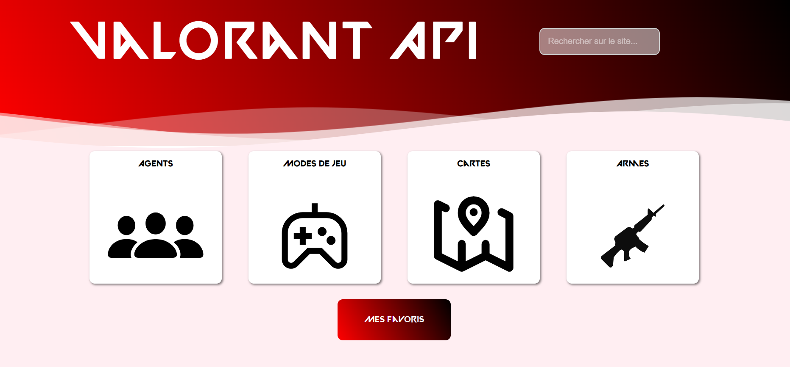
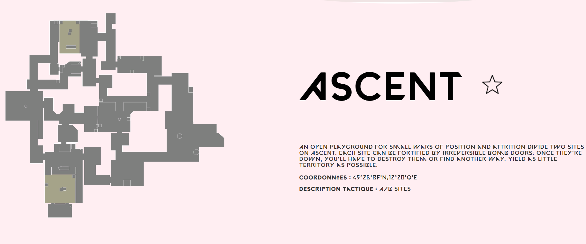
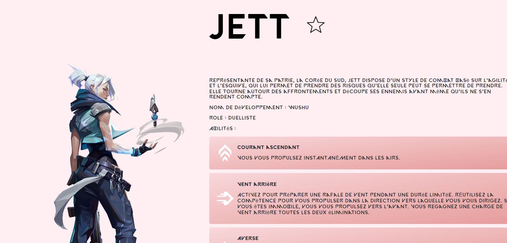

# Valorant API



## Features

- **Maps**: View detailed information about all maps in Valorant.

- **Agents**: Explore agent's details and abilities

- **Game Modes**: Learn about different game modes available in Valorant

- **Weapons**: Discover weapons, their skins, and skns variants

- **Favorites**: Keep track of your favorite agents and maps

## Installation

To run this project locally, make sure you have Go installed on your system

1. Clone the repository

```bash
git clone https://github.com/romaingdr/ValorantAPI
```

2. Start the server

```go
go run main.go
```

3. Visit `http://localhost:8081/accueil` in your browser

## Credits

- [Valorant-API](https://dash.valorant-api.com/) for providing the Valorant API
- [Valorant](https://playvalorant.com/) for the game
- [Me](https://github.com/romaingdr) for the project